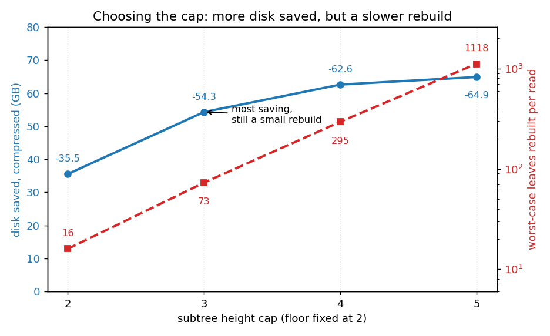

# How much cold state can EIP-8188 move out?

We ran a three-step experiment on a real mainnet go-ethereum (geth) node to see how much disk you save
by pulling "cold" state out of the hot database. This writes up what each step does
and what it actually measured.

The three steps:

- **Baseline.** The normal geth node.
- **Period injection.** Tag every account and slot with when it was last used, so we
  can tell what is cold.
- **Move inactive state out.** Pull the cold parts out of the main database into a
  flat file, shrinking what the node has to keep hot.

Everything below is measured on one data directory: mainnet at block 19,999,256.

---

## How geth stores the state

The state is every account (balance, nonce, code, storage root) plus every contract's
storage slots. geth keeps it twice inside its key-value store (PebbleDB).

**1. The Merkle-Patricia Trie (MPT).** The authenticated tree whose root hash is the
block's state root.

```
   account trie  (root hash = stateRoot)
            |
         (branch)                 
        /        \
  (extension)   (branch)          
      |          /     \
   (branch)   (leaf)  (leaf)      
    /    \
 (leaf) (leaf)

   every contract account's storage is its own trie of the same shape.
```

**2. The snapshot.** A flat key-to-value copy of just the leaves, so a read does not
have to walk the tree.

```
   accountHash             -> account
   accountHash + slotHash  -> slot value
```

---

## Step 1: baseline

The node at block 19,999,256. Sizes are logical bytes (sum of record contents) unless noted. The
physical on-disk compacted PebbleDB is about 251.75 GB.

| component | count | size |
|---|---:|---:|
| trie nodes (account) | 334.7 M | 38.81 GB |
| trie nodes (storage) | 1,560.7 M | 109.33 GB |
| **trie total** | **1,895.4 M nodes** | **148.13 GB** |
| snapshot, account (keys / values) | - | 7.58 / 3.77 GB |
| snapshot, storage (keys / values) | - | 69.74 / 13.32 GB |
| **snapshot total** | ~1.15 B records | **101.38 GB** |

---

## Step 2: period injection

**What it does.** For each account and slot, store the most recent period it was
written. This goes only into the snapshot. A "period" is just a time window, here 1,314,000 blocks (about six months). A leaf is inactive if it has not been written for at least `minAge` periods (here it's 2, so 1-year inactivity in total).

**Where the timestamps come from.** In this experiment, we used [Xatu](https://github.com/ethpandaops/xatu) as the primary data source.

```
    access-history source                     injector             snapshot (pebble)

   +---------------------+  (key, block)   +-------------+   read -> set period -> write
   | addr A wrote @ blk  | --------------> | period =    |   +---------------------------+
   | slot S wrote @ blk  |                 | (blk - fork)| ->| accountHash -> [acct, P]  |
   | ...                 |                 |   / perLen  |   | slotHash    -> [value, P] |
   +---------------------+                 +-------------+   +---------------------------+
                                                              (only ever raises a period)
```

`ComputePeriod(block) = (block - forkBlock) / blocksPerPeriod`. With `forkBlock`
17,371,256 and `blocksPerPeriod` 1,314,000, the head sits in period 2. The update only
ever raises a record's period, so the source can emit diffs in any order, in batches,
with retries.

**How it is stored, and why it barely costs anything.** The period is an optional
trailing RLP field. When it is 0 (the record was never written in the tracked range)
the bytes are identical to a legacy record, so only recently-written records grow.

```
   account record:
     before:  RLP[ nonce, balance, storageRoot, codeHash ]
     after:   RLP[ nonce, balance, storageRoot, codeHash, period ]   (+1 to 2 bytes)

   storage slot record:
     before:  RLP("value")                a plain string
     after:   RLP[ "value", period ]      a 2-item list  (+2 to 3 bytes)
```

**Cost (step 1 to step 2).**

| | trie | snapshot |
|---|---|---|
| change | none, byte-identical | +0.2 to 0.3 GB (on ~32.5 M accounts plus recently-written slots) |
| as % | 0% | under 0.5% of the 101 GB snapshot |

---

## Step 3: move inactive state out

Now that every leaf carries a last-used period (step 2), we can pull the cold parts of the
state out of the main database into a flat file, leaving the node a smaller hot working set.

### What we move

We look for **cold subtrees**: a node whose every leaf underneath is inactive
(`currentPeriod - leafPeriod >= 2`, using the periods from step 2). When we find one we take
the largest cold subtree we can, under two limits:

- a **cap** on its height, so one subtree never gets too big. Height is counted from the
  leaves, so a leaf is height 1, a branch directly above leaves is height 2, and so on, with
  at most 16^(height-1) leaves under a subtree of that height.
- a **floor** of height 2, so we never move a lone cold leaf by itself. Moving a single leaf
  costs a 17 byte stub plus an archive record and saves no interior, a net loss.

The cap is the one knob worth tuning, and most of this section is about choosing it.

```
   BEFORE (in PebbleDB)                  AFTER

        N (cold subtree root)            N  ->  17-byte stub  --+
       / \                                                      |
  (branch)(branch)   interior nodes      subtree gone from      |
   / \     / \         (deleted)         PebbleDB                v
 leaf leaf leaf leaf  (all inactive)            nodearchive (flat file)
                                                +------------------------+
                                                | [leaf][leaf][leaf] ... |
                                                +------------------------+
```

### What we store, and reading it back

For each moved subtree we write its **leaves only** to the flat file and replace the whole
subtree with a 17 byte pointer:

- The stub, 17 bytes in PebbleDB: `[0x00 marker | fileOffset:8 | size:8]`. A real trie
  node's first byte is `0xc0` or higher, so `0x00` can never be mistaken for one. The offset
  and size bracket this subtree's records in the file.
- The archive, leaves only: one RLP record per leaf, `[pathToLeaf, leafValue]`. No interior
  nodes, just the leaves and their relative paths. The interior is deleted from PebbleDB.
- Reading it back: load the records, re-insert each `(path, value)` into a fresh mini-trie.
  The rebuilt subtree is identical to the original, and its hash has to match the one the
  stub expects, which doubles as a corruption check.

```
   read or write of an cold leaf:
     stub(offset, size) -> read records -> rebuild subtree in memory -> use it
```

Storing leaves only and rebuilding the interior on read is the choice that makes this pay
off, and it helps to see what the obvious alternative costs.

### Why leaves only: the naive alternative

The naive move-out copies every cold node into the flat file as-is, interior branches and
all. It frees the most from the main database, because it relocates everything cold, but the
flat file pays for it. We measured both on the same datadir, in logical value bytes so the
two are counted the same way:

| | naive: every cold node, full structure | ours: cold subtrees, leaves only (cap 3) |
|---|---:|---:|
| what lands in the flat file | the whole subtree, interior and all | the leaves only, interior rebuilt on read |
| stubs written | 316.3 M | 239.6 M |
| trie shrinks from 148.1 GB to | 32.7 GB (-115.5) | 58.7 GB (-89.4) |
| flat file | **162.39 GB** | **82.96 GB** raw / **41.58 GB** compressed |
| net total disk | **+46.93 GB** (goes up) | **-6.43 GB** raw / **-47.81 GB** compressed |

The naive approach frees more from the main database (-115 GB of trie against our -89 GB), but
its flat file is 162 GB, larger than what it freed, so total disk goes *up* by about 47 GB.
Storing leaves only keeps the flat file small enough that total disk comes *down*. Dropping
the interior and rebuilding it on read is the whole trick.

### Finding the cold subtrees

One streaming pass walks the trie and the period-stamped snapshot side by side, rolling the
all-inactive answer up from the leaves. When a cold subtree is complete and within the floor
and cap, it materialises the subtree, writes the leaf records, stages the stub, and deletes
the interior, all in the same pass. The rebuilt-hash check runs before anything is deleted,
so a mismatch aborts that one subtree rather than corrupting state.

### Compressing the archive

The flat file is raw on disk, but it compresses well. Squeezed in roughly 1 MB chunks, one
zstd frame per chunk plus a small offset table, it drops by about half while still letting
you rebuild a single subtree by decompressing just its chunk. Compression is the biggest
single lever in the whole pipeline, so the results below report both the raw and the
compressed archive. Two things that did not work: compressing each leaf or each subtree on
its own, because the blocks are too small for zstd to find anything, and a shared dictionary
trained on sample records, which moved the number by a couple of points and sometimes made
it worse. You have to compress many subtrees together.

### Choosing the cap height

The floor of 2 means **every cap moves the same leaves**. The cap only changes how those
leaves are grouped: a taller cap merges a cold region into one big subtree instead of many
small ones, which leaves fewer 17 byte stubs behind and deletes more interior, so the main
database shrinks more. We swept the cap from 2 to 5, floor fixed at 2:

| cap height | trie reduction | archive (raw) | archive (compressed) | net disk (raw) | net disk (compressed) | subtrees moved | worst-case rebuild (leaves) |
|---:|---:|---:|---:|---:|---:|---:|---:|
| 2 | -66.93 GB (-45.2%) | 63.35 GB | 31.39 GB | -3.58 GB (-1.4%) | -35.54 GB (-14.1%) | 295.1 M | 16 |
| 3 | -95.86 GB (-64.7%) | 82.96 GB | 41.58 GB | -12.90 GB (-5.1%) | **-54.28 GB (-21.6%)** | 239.6 M | 73 |
| 4 | -107.37 GB (-72.5%) | 89.19 GB | 44.79 GB | -18.18 GB (-7.2%) | -62.58 GB (-24.9%) | 158.4 M | 295 |
| 5 | -110.03 GB (-74.3%) | 89.98 GB | 45.16 GB | -20.05 GB (-8.0%) | -64.87 GB (-25.8%) | 116.4 M | 1118 |

The two percentages use different baselines. The trie reduction is against the **trie size**
(148.1 GB from step 1), since the move-out only deletes trie nodes and leaves the snapshot
alone. The **net disk** columns are against the full **251.75 GB on-disk footprint**.

A taller cap always saves more disk, but the gains shrink fast, each step worth about half
the last, while the worst-case rebuild grows the other way:



This is the real tradeoff in picking a cap. A greater cap reduces disk further, but every
read that touches cold state rebuilds the whole subtree it lands in, and a bigger subtree
is a slower rebuild. Cap 2 rebuilds at most 16 leaves, cap 5 up to over a thousand. So the
sweet spot is not the deepest cap. **Cap 3 is the best balance**: it banks most of the disk
saving (-54.28 GB out of a possible -64.87 GB at the deepest cap) while keeping the rebuild
small, at most 73 leaves. Cap 4 trades another 8 GB for a roughly four times larger rebuild,
and cap 5 saves almost nothing for a rebuild past a thousand leaves.

---

## End to end summary

```
   STEP 1 baseline          STEP 2 period inject        STEP 3 move inactive out
   ---------------          --------------------        ------------------------
   trie     148.1 GB  --->  trie     148.1 GB  (same) -> trie     ~59 GB + 240 M stubs
   snapshot 101.4 GB  --->  snapshot 101.6 GB  (+0.3) -> snapshot 101.6 GB (same)

   no timestamps            every leaf has its          nodearchive 83 GB raw
                            last-used period            (42 GB compressed)
```

| | Step 1 baseline | Step 2 post-inject | Step 3 post-move-out (floor 2 / cap 3, the best balance) |
|---|---|---|---|
| trie nodes | 1,895.4 M | 1,895.4 M | **788.0 M** (-58%) |
| snapshot | 101.38 GB | ~101.6 GB (+under 0.5%) | ~101.6 GB |
| external archive | - | - | 82.96 GB raw / **41.58 GB** zstd |
| PebbleDB (physical, compacted) | 251.75 GB | 251.75 GB | **155.89 GB** (-95.9 GB) |
| **net total disk vs baseline** | - | ~+0.3 GB (+0.1%) | **-12.90 GB (-5.1%) raw / -54.28 GB (-21.6%) compressed** |

What we take from this:

- The move-out shrinks the hot database by deleting cold interior nodes and relocating
  cold leaves. With the floor 2 / cap 3 rule PebbleDB drops 95.9 GB and the leaves land in
  a flat file you can park on cheaper storage.
- Total on-disk still shrinks after counting the archive: -12.90 GB raw, and -54.28 GB
  (about 22%) with the chunked compression. The price is rebuilding a small subtree on a rare access of cold state, at most 73 leaves at this cap.
- The cap height is a tradeoff between disk size and rebuild cost. A deeper cap frees more disk but makes
  the worst-case rebuild larger, and the disk gains shrink fast while the rebuild cost
  climbs. Cap 3 is the best balance, cap 4 is more aggresive (more disk, bigger rebuild),
  and cap 5 is barely worth it.

## Open Questions

**Performance under real workloads.** Everything above is a static footprint
measurement. What it does not measure is the runtime cost of reading cold state. Every
hit on a moved subtree pays a rebuild: read the leaf records, rebuild the subtree in memory,
and hash-check it before returning. That is cheap at a shallow cap, at most 73 leaves at
cap 3, but it grows with the cap, to about 300 leaves at cap 4 and over a thousand at cap 5,
and it happens on every access to an cold subtree. This is the main reason a deeper cap
is not automatically better despite saving more disk.

So the footprint winner is not automatically the workload winner. A design that saves the
most disk can still lose if a common access pattern keeps reaching into cold subtrees and
paying the rebuild. The experiment we have not run yet is to replay real mainnet blocks,
plus some adversarial patterns that deliberately touch cold state, against an cold
datadir and measure, such as rebuilds per block and rebuild latency. Compression adds a second layer
here, since a hit on a compressed chunk also pays a decompress of that chunk. Hence,
the numbers presented in this document should solely serve as references for storage footprint, and not performance.
